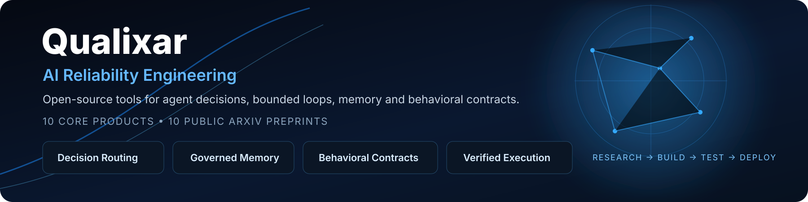

<p align="center">
  
</p>

# Qualixar — AI Reliability Engineering

Open-source tools for AI agent decisions, memory, behavioral contracts and bounded execution. Qualixar is an independent research initiative by [Varun Pratap Bhardwaj](https://www.varunpratap.com).

**10 core products · 10 public arXiv preprints**

## Choose a starting point

| Your task | Product | Start here |
| --- | --- | --- |
| Choose a task, tool or review route from explicit options | [Jev Decision Layer](https://github.com/qualixar/jev-decision-layer) | [Decision recipes and setup](https://qualixar.com/products/jev-decision-layer) |
| Run an agent loop until an independent check passes, within declared limits | [Bounded Loops & Graphs](https://github.com/qualixar/bounded-loops) | [Keyless example and receipt verification](https://github.com/qualixar/bounded-loops/blob/main/docs/QUICK_PROOF.md) |
| Store project context and recall it across AI sessions | [SuperLocalMemory](https://github.com/qualixar/superlocalmemory) | [Install and try a local memory workflow](https://www.superlocalmemory.com) |
| Define behavioral contracts and check adapter outputs | [AgentAssert](https://github.com/qualixar/agentassert-abc) | [Released API and getting started](https://agentassert.com/getting-started/) |

Jev returns advisory decisions; its answer does not authorize an action. Bounded Loops' first keyless example uses a stub worker and real pytest checks. SuperLocalMemory's optional providers and connectors have separate network behavior. AgentAssert's small example checks a caller-supplied flag; it is not a security classifier.

## Try a product

```bash
# Bounded Loops: install a loop in your project and run its keyless example
python -m pip install bounded-loops
bl loops install bug-fix-red-green --dest ./loops
bl run loops/bug-fix-red-green --yes --run-id first-proof

# SuperLocalMemory: install, then select your operating mode explicitly
npm install -g superlocalmemory
slm setup

# AgentAssert: install the YAML and mathematical dependencies
python -m pip install 'agentassert-abc[yaml,math]'
```

For Jev, follow the [host-specific installation guide](https://github.com/qualixar/jev-decision-layer#install-and-upgrade). Check each repository's supported platforms and setup requirements before installation.

## Research and reproducible examples

Read [Qualixar's research directory](https://qualixar.com/research/papers) alongside each product's source and examples. Public arXiv papers are **preprints**; an arXiv record does not establish peer review. Mathematical results and experiment figures apply to the assumptions, datasets and versions described in each paper.

- [Bounded Loops — arXiv:2609.27871](https://arxiv.org/abs/2609.27871)
- [SuperLocalMemory 4.0 — arXiv:2608.08253v2](https://arxiv.org/abs/2608.08253v2)
- [Agent Behavioral Contracts — arXiv:2602.22302](https://arxiv.org/abs/2602.22302)

## Ask, propose, and share

Use the [Qualixar community hub](https://github.com/orgs/qualixar/discussions):

- [Q&A](https://github.com/qualixar/.github/discussions/categories/q-a): installation, configuration and usage questions.
- [Ideas](https://github.com/qualixar/.github/discussions/categories/ideas): describe a task and the workflow you want to improve.
- [Polls](https://github.com/qualixar/.github/discussions/categories/polls): help prioritize tutorials and examples.
- [Announcements](https://github.com/qualixar/.github/discussions/categories/announcements): maintainer updates and release links.
- [Show and tell](https://github.com/qualixar/.github/discussions/categories/show-and-tell): share an integration and what you observed.

Report reproducible bugs in the affected product's issue tracker. Follow the repository's published security-reporting instructions where available; do not post vulnerabilities, secrets, private prompts or customer data publicly. See the [community guide](https://github.com/qualixar/.github/blob/main/COMMUNITY.md).

If a product helps your work, starring its repository is one way to follow it. Using the tools and participating in discussions does not require a star.

## All 10 products

Choose the capability your workflow needs, then follow the setup, examples or research in **Resources**. Product names link directly to the source repositories.

| Product | Description | Focus | When to use it | Resources |
| --- | --- | --- | --- | --- |
| [Jev Decision Layer](https://github.com/qualixar/jev-decision-layer) | Returns advisory choices from explicit options, with reasons, constraints and decision receipts. | Decision routing | Choose a task, tool, model tier or review route. | [Product](https://qualixar.com/products/jev-decision-layer)<br>[Recipes](https://qualixar.com/products/jev-decision-layer/recipes)<br>[Guide](https://github.com/qualixar/jev-decision-layer/blob/main/docs/WORKING_WITH_JEV.md) |
| [Bounded Loops](https://github.com/qualixar/bounded-loops) | Runs agent loops and graphs within declared limits; independent gates check completion and hash-chained ledgers record results. | Verified execution | Fix failing tests or repeat a workflow until its acceptance check passes. | [Product](https://qualixar.com/products/bounded-loops)<br>[Recipes](https://qualixar.com/products/bounded-loops/recipes)<br>[Proof](https://github.com/qualixar/bounded-loops/blob/main/docs/QUICK_PROOF.md) |
| [SuperLocalMemory](https://github.com/qualixar/superlocalmemory) | A governed memory control plane combining persistent context, multi-channel retrieval, knowledge graphs and workspace isolation. | Memory & governance | Carry project knowledge across agent sessions while controlling access, retention and context. | [Product](https://www.superlocalmemory.com)<br>[Workflows](https://www.superlocalmemory.com/recipes)<br>[Research](https://www.superlocalmemory.com/research) |
| [SLM MCP Hub](https://github.com/qualixar/slm-mcp-hub) | Federates MCP servers behind three discovery-and-call tools, with shared backends and on-demand tool lookup. | Tool federation | Connect multiple clients to many servers without loading every tool definition up front. | [Product](https://qualixar.com/products/slm-mcp-hub)<br>[Setup](https://github.com/qualixar/slm-mcp-hub#quick-start)<br>[Routing](https://github.com/qualixar/slm-mcp-hub#routing-modes) |
| [SkillFortify](https://github.com/qualixar/skillfortify) | Scans agent skills and MCP configurations using capability analysis, dependency checks and supply-chain reports. | Skill security | Inspect skills before installation and add security checks to your delivery pipeline. | [Product](https://qualixar.com/products/skillfortify)<br>[Guide](https://github.com/qualixar/skillfortify#quick-start)<br>[Synthetic benchmark](https://github.com/qualixar/skillfortify/blob/main/benchmarks/RESULTS.md) |
| [AgentAssert](https://github.com/qualixar/agentassert-abc) | Defines behavioral contracts and enforces hard or soft constraints against application-supplied agent state. | Runtime contracts | Check permissions, limits and required signals at an action boundary. | [Product](https://agentassert.com)<br>[Templates](https://agentassert.com/recipes/)<br>[Guide](https://agentassert.com/getting-started/) |
| [AgentAssay](https://github.com/qualixar/agentassay) | Measures behavioral regressions with execution traces, statistical verdicts and adaptive trial budgets. | Testing & measurement | Compare agent behavior after changing prompts, models or tools; reuse existing traces. | [Product](https://qualixar.com/products/agentassay)<br>[Guide](https://github.com/qualixar/agentassay#quick-start-pick-your-framework)<br>[Paper](https://arxiv.org/abs/2603.02601) |
| [Agent Amplifier](https://github.com/qualixar/agent-amplifier) | Adds effort routing, goal anchoring, convergence checks and token budgets to coding-agent sessions. | Coding runtime | Keep coding sessions focused and manage effort through supported host adapters. | [Product](https://qualixar.com/products/agent-amplifier)<br>[Setup](https://github.com/qualixar/agent-amplifier#install-60-seconds)<br>[Post](https://qualixar.com/blog/agent-amplifier-v1-launch) |
| [SLM Mesh](https://github.com/qualixar/slm-mesh) | Connects agents across harnesses with peer messages, shared state and advisory file locks, locally or across a LAN. | Agent coordination | Coordinate work between agent sessions on one computer or multiple networked machines. | [Product](https://qualixar.com/products/slm-mesh)<br>[Setup](https://github.com/qualixar/slm-mesh#multi-machine-setup)<br>[Post](https://qualixar.com/blog/slm-multi-machine-release) |
| [Qualixar OS](https://github.com/qualixar/qualixar-os) | Designs and runs agent teams, evaluates outputs through a judge pipeline, and retries with structured feedback. | Orchestration & judging | Run multi-agent tasks with quality review, model routing and budget tracking. | [Product](https://qualixar.com/products/qualixar-os)<br>[Setup](https://github.com/qualixar/qualixar-os#install-in-30-seconds)<br>[Post](https://qualixar.com/blog/built-an-os-for-ai-agents) |

Use each repository’s setup guide for supported hosts and operating modes. Benchmark results apply to their published datasets and protocols; the SkillFortify benchmark linked above uses generated specimens.

## All 10 research papers

These public arXiv records are preprints. Read each paper for its assumptions, version, experimental scope and limitations. Listing a paper beside a product does not establish that every current feature was evaluated in that paper.

| Paper | arXiv | Related project |
| --- | --- | --- |
| Bounded Loops: Pre-Run Spend Bounds, Proved Termination, and Verified Completion for Agent Harnesses | [2609.27871](https://arxiv.org/abs/2609.27871) | Bounded Loops |
| Agent Behavioral Contracts II: Certifying Compositional Reliability Without Assuming Independence | [2608.12895](https://arxiv.org/abs/2608.12895) | AgentAssert |
| SuperLocalMemory 4.0: The Governed Memory Operating System for AI Agents | [2608.08253](https://arxiv.org/abs/2608.08253) | SuperLocalMemory |
| Qualixar OS: A Universal Operating System for AI Agent Orchestration | [2604.06392](https://arxiv.org/abs/2604.06392) | Qualixar OS |
| SuperLocalMemory V3.3: The Living Brain -- Biologically-Inspired Forgetting, Cognitive Quantization, and Multi-Channel Retrieval for Zero-LLM Agent Memory Systems | [2604.04514](https://arxiv.org/abs/2604.04514) | SuperLocalMemory |
| SuperLocalMemory V3: Information-Geometric Foundations for Zero-LLM Enterprise Agent Memory | [2603.14588](https://arxiv.org/abs/2603.14588) | SuperLocalMemory |
| AgentAssay: Token-Efficient Regression Testing for Non-Deterministic AI Agent Workflows | [2603.02601](https://arxiv.org/abs/2603.02601) | AgentAssay |
| Formal Analysis and Supply Chain Security for Agentic AI Skills | [2603.00195](https://arxiv.org/abs/2603.00195) | SkillFortify |
| Agent Behavioral Contracts: Formal Specification and Runtime Enforcement for Reliable Autonomous AI Agents | [2602.22302](https://arxiv.org/abs/2602.22302) | AgentAssert |
| SuperLocalMemory: Privacy-Preserving Multi-Agent Memory with Bayesian Trust Defense Against Memory Poisoning | [2603.02240](https://arxiv.org/abs/2603.02240) | SuperLocalMemory |

[Qualixar](https://qualixar.com) · [SuperLocalMemory](https://www.superlocalmemory.com) · [AgentAssert](https://agentassert.com) · [Author and research](https://www.varunpratap.com)
